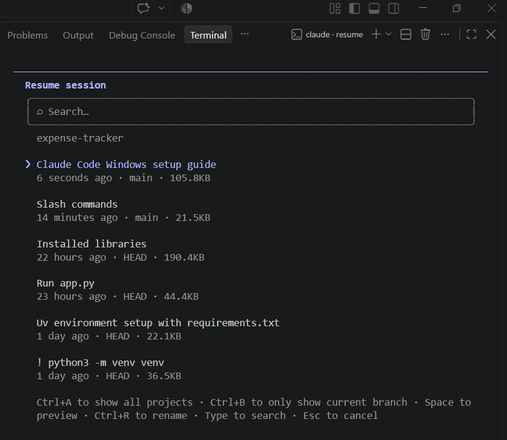
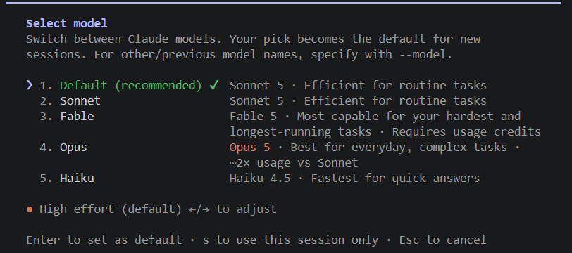
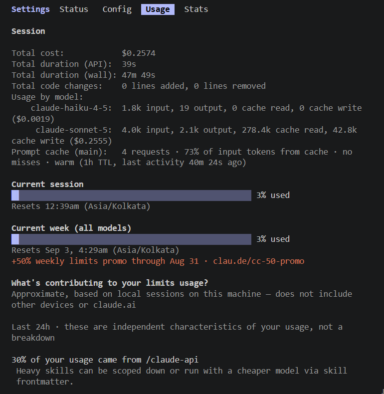
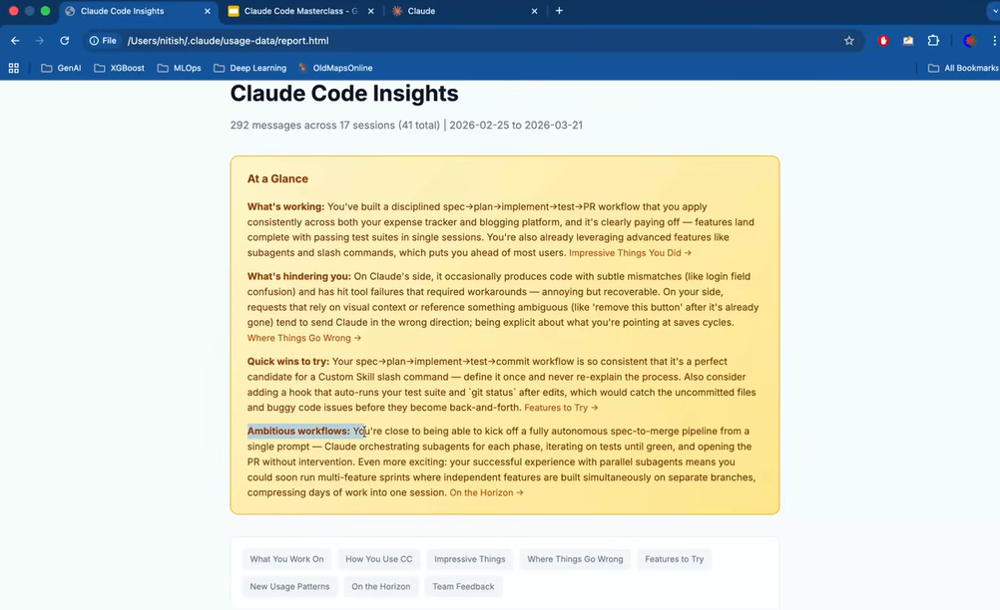

# Slash Commands in Claude Code

Slash commands are shortcuts you type inside a Claude Code **session** starting with a `/` that trigger predefined actions or workflows instantly. It is executed during an interactive terminal session to manage project context, switch models, and run automated developer workflows. Recent updates allow the AI agent itself to invoke these commands when solving problems

2 types of commands: **Built-in** vs. **Custom**: built-in commands with claude (like `/exit`, `/rename`, `/model`, and `/usage`) and custom commands you can build for project-specific tasks.


## Sessions in Claude

A session is one conversation with Claude Code — everything from when you run claude to when you type `/exit`. It has a unique ID, captures the full message history, all file reads, all tool results, and the current working directory.

Sessions are saved automatically to `~/.claude/projects/` and can be resumed at any time, even after closing the terminal.


Go to the terminal press ` ctrl + ` in the VS code and if you want to look at your past conversations type in `claude -r` in the terminal. (Make sure you dont type it in the claude terminal).

```
cd D:\Github\expense-tracker
claude -r
```



We can see the last conversations and select it to resume the conversation in future.

Now lets say if you want to move from 1 session to another for that use command: `\resume`. From within a session itself, you can go to a new session.

### Best Practices

1. One session `=` one task
2. Name your session immediately once you have started it. Else the AI will name it and it will be based on your 1st question. Easy if you rename based on your preference. Use command `/rename`. 

 You are inside a session named `Installing Libraries` name given by AI. You are going to rename it.
  ```
  ❯ /rename libraries_session
  ⎿  Session renamed to: libraries_session  
  ```
  Now you can check again using `claude -r` in the terminal and you will see the updated new session.

3. Commit frequently within a session
  In a session frequently commit within a session when you have achieved a milestone.
  Example you are building a website for each feature name a session so this will lead to seperation of task and easy follow-up and checks in future. And contect windows also dont get mixed up. 
4. Use `/btw` (by-the-way) for quick questions
  You can ask questions which will not be part of your conversation history (i.e., its not related to work and is not needed). So your context will not be polluted.

  So once the question has been answered you can press on space bar and that question will be removed from the session and you wont see it.

5. Export a session before a big refactor or a big change.
  You can type `/export file.md`. And the whole session's conversation will be here and you can use it to provide context in your new work.

  ```
  ❯ /export file.md
  ⎿  Conversation exported to: D:\Github\expense-tracker\file.md  
  ```

### Other Commands

1. `/logout`: Logs you out of the anthropic account. And if you enter `claude` again in terminal from the start you will have to sign in.
2. `/login` - to login to an account if you have multiple accounts.
3. `/model` - Enables you to choose between different models.
   

4. `/usage` - Shows the usage details.
   Claude tracks usage at 2 levels:
   - Current session usage
   - Weekly limits
   

5. `/extra-usage` - to top-up or recharge your account.
6. `/stats` - give stats based on usage
7. `/insights` - generates a report based on usage and how you can improve further.
   

8. `/config`: change claude settings based on your requirments.
9. `/permissions`: [assign permissions to your tools and agents.](https://youtu.be/eW9FADWxS1k?list=PLKnIA16_RmvaYH3poI0oJvbDF4zEvpq8W&t=1522) Eg: Reading tool to read a code, writing code to write or modify code, search tool to search in web, you can also add your tools/skills using MCP,etc. This helps to avoid multiple permission requests while the code is executed.
10. `/theme`
11. `/voice`: voice mode enabled. Hold space to record and that will be taken up as prompt.


### Claude Models
1. ***Opus*** — most powerful but most expensive. Used for complex programming tasks.

2. ***Sonnet*** — the default for most users. Best balance of speed, quality, and token cost. Good for everyday coding tasks.

3. ***Haiku*** — fastest and cheapest. Use for simple, repetitive, or exploratory tasks where you don't need deep reasoning.

A common power-user pattern is to use **Opus** for the planning phase — where you’re thinking through architecture, writing specs, making decisions — then switch to **Sonnet** for the implementation phase where the thinking is done and you just need reliable code generation.


## Reference
1. [Slash Commands in Claude Code - CampusX](https://youtu.be/eW9FADWxS1k?si=iOrNuJBS7UGekc4S)