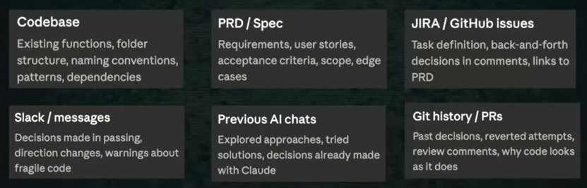
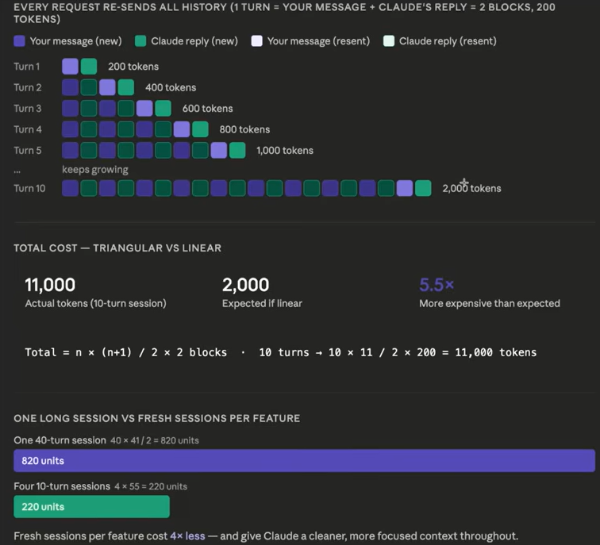
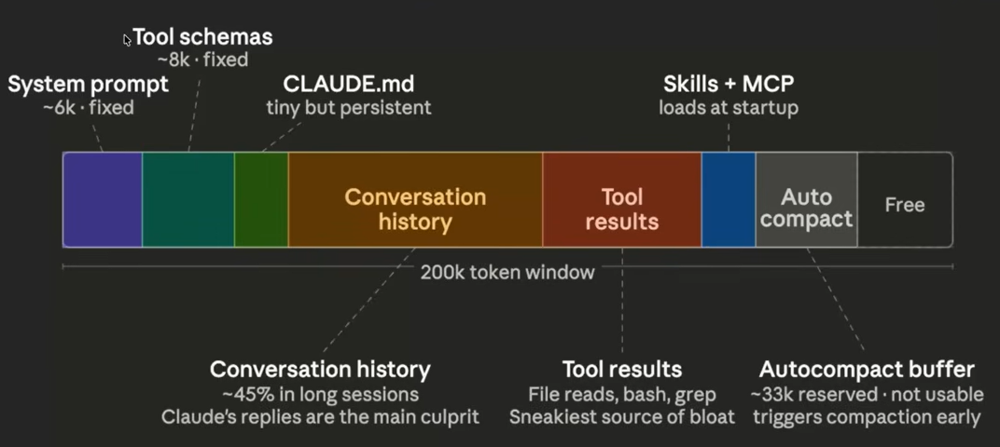
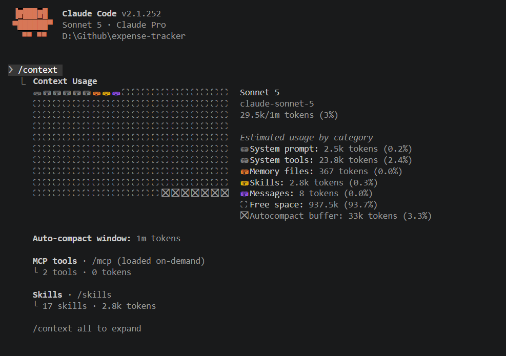
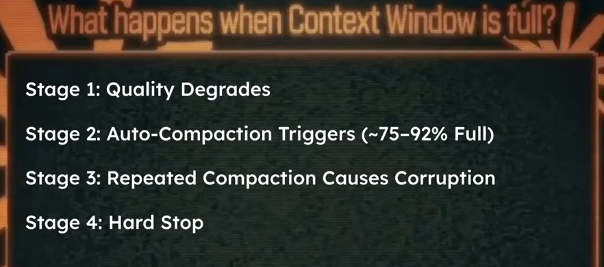

# Context Window

**Context Window** is the amount of information (in tokens) that a model like Claude code can see and remember at one time while generating a response. Think of it as the model's working memory.  

**Context**: Its all the information available to understand something correctly.

Usually when working on a project comes from these sources:  

## Claude Code Context Window

- Sonnet has a context window size of 200k tokens.
- Opus has a context window size of ~1M tokens.
- Each new session starts with a fresh context window.
- Token are consumed by your prompts(input tokens) and Claude's replies(output tokens).
- Claude's replies consume 6x more tokens than your messages.
- Every request sends the entire conversation history from scratch.(LLMs are stateless and have no memory.)
- Below image shows how context window size increases with each conversation:
  
  That's why its better to break down work or features into different sessions rather than doing all the features in a single session.

- Claude Code itself is an agent (LLM + tool) and it can call sub-agents. Subagents get their own isolated context window completely seperate from the main session. 
- Subagents return only a summary to the main context - not their full work history.
- We usually get only 150k out of the 200k context window. As system prompts, tools, skill and MCP details, etc take up some space. 
  - Auto Compact: If you use 70-75% tokens it will summarize the entire conversation history as compact tokens. 
  

  - You can see this if you type in command `/context` for the current work at this stage.
  
    
- Context window affects cost. So if you are conscious with context window then you will automatically use tokens wisely.
- Context window shapes how you structure your workflow. So breakdown work into multiple sessions.
- As the Context window fills up, the Claude Code's response quality degrades.

### What happens when context window is full?

When claude code sees that the 75-92% is full then **Auto-comapction** triggers, it will take the whole conversation history and generates summary and your conversation history is freed up. This generated summary will be part of the Auto comapact tokens. 

This repeated compaction will keep on happening when the context window is 75-90% full and the result will be part of the 33k tokens reserved for auto-compact. When that 33k tokens is also filled. Then it will not allow more comapction is that session. And you have to create a new session.

You can also do this using command `/compact` if you see the responses are not good enough. [compact slash command in action](https://youtu.be/lN5tLx2_7HQ?list=PLKnIA16_RmvaYH3poI0oJvbDF4zEvpq8W&t=1713). (Use ctrl+o to see the compact summary)

Remember the auto-compact can loose part of summary when compaction is done. So its better to use `/compact` when you have some time and save important summary or parts of work.

If your context window and auto-compact token is full then try using sub-agents as they have a different isolated context window.  

Last option - use `/clear`  to clear all conversation history in that session or create a new session.

### Good Practices

1. Develop 1 feature in 1 session.
2. Use `/compact` proactively instead of relying on Claude's auto-compact.
3. Write focuses, specific prompts.
4. Use sub-agents for isolated or exploratory work.
5. Use `.claudeignore` to keep irrelevant files out. Eg: .venv files, build files, etc.

[Why claude terminal is preferred over the claude VS code extension or GUI?](https://youtu.be/lN5tLx2_7HQ?list=PLKnIA16_RmvaYH3poI0oJvbDF4zEvpq8W&t=2014)  
Terminal is better as GUI redirects to terminal for some cases such as Hooks, MCP, etc.

   