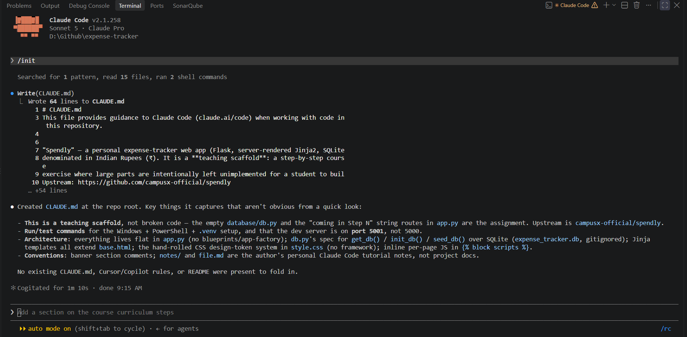

# CLAUDE.md

## Why CLAUDE.md?

LLMs dont have memory. And as Claude Code is built on top of LLMs so it cannot remember things from previous sessions. Need to repeat instructions across sessions and is error-prone if you miss out specifyinh something.

So a file is created and it will have the projects details and specifications of that project each time that session is created. 

The **CLAUDE.md** file is a special project-level instruction file used by Claude Code to guide how it behaves while working on your codebase. Think of it as a persistent system prompt for your project. This is located in your project root that stores instructions, architectural details, coding styles, and project constraints. 

Instead of repeatedly telling Claude:
* how your project is structured
* coding conventions
* how to run/build/test
* what tools to use

we put all of that into **CLAUDE.md**, and Claude automatically uses it as context every time.

You can create it manually or use the `/init` command to have Claude automatically analyze your codebase and generate a starting point.

### Why `/init`?

| Situation | Why `/init` helps |
| --- | --- |
| Onboarding an **existing codebase** you didn't write | Faster than reading everything yourself |
| **Large repos** with many files | Claude can spot patterns you might forget to document |
| You're new to CLAUDE.md | Good way to see what the format looks like |
| Quick prototypes | Don't want to invest time writing docs |

You can do manually but there are chances you can miss out on anything. So better to generate CLAUDE.md using `\init` first and then modify that file.

### How `/init` works?

- Triggers an internal agent that takes over the scanning and writing task
- Agent scans high-signal config files first — `package.json`, `requirements.txt`, `Makefile`, `README.md`
- Reads directory tree structure
- Infers tech stack, folder layout, and naming conventions
- Writes a CLAUDE.md to the project root with the inferred context
- The generated CLAUDE.md is roughly 30% useful.
- The remaining 70% — workflows, constraints, what to avoid, deployment targets, naming conventions — we have to write as a programmer.

### Contents of CLAUDE.md

1. **Project Context**  
    A short description of the project so Claude immediately understands what it is building or modifying.  

    **Example:**  
    This is a FastAPI backend for a health-tracking application that stores patient BMI records and exposes CRUD APIs.

2. **Architecture**
    Explains how the codebase is structured and where things belong.   

    **Example:**  
    * Routes live in `routers/`
    * Business logic lives in `services/`
    * Schemas live in `schemas/`
    * Persistence logic lives in `repository/`

3. **Code style**
    This section tells Claude how code should look and what conventions to follow.  

    **Example:**  
   * Use Python type hints everywhere.
   * Prefer Pydantic models for request and response schemas.
   * Keep functions small and focused.

4. **Preferred libraries**
    Constrains what tools/frameworks should be used.    
    
    **Example:**  
    * Use FastAPI for APIs
    * Use Pydantic for validation
    * Use SQLAlchemy for ORM
    * Do not introduce new dependencies unless necessary

5. **Commands**
    Lists exact commands for running, testing, and maintaining the project.

    **Example:**  

    * Install dependencies: pip install -r requirements.txt
    * Run dev server: uvicorn main:app --reload
    * Run tests: pytest

6. **Critical rules**
    Highlights critical warnings, edge cases, and things to avoid

    **Example:**  

    * Do not modify `database.py` unless absolutely necessary.
    * Patient IDs are provided by the client; do not auto-generate UUIDs.

