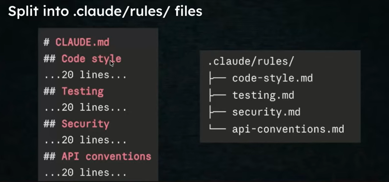
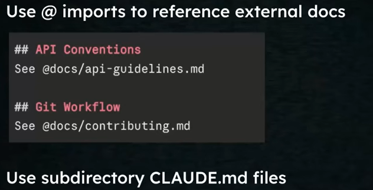
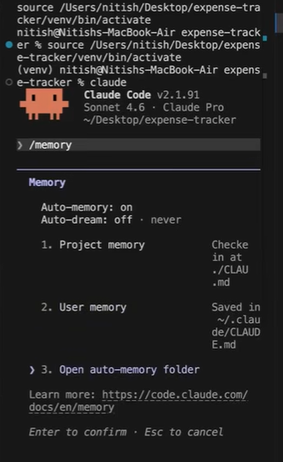

# CLAUDE.md

## Why CLAUDE.md?

LLMs dont have memory. And as Claude Code is built on top of LLMs so it cannot remember things from previous sessions. Need to repeat instructions across sessions and is error-prone if you miss out specifyinh something.

So a file is created and it will have the projects details and specifications of that project each time that session is created. 

The **CLAUDE.md** file is a special project-level instruction file used by Claude Code to guide how it behaves while working on your codebase. Think of it as a persistent system prompt for your project. This is located in your project root that stores instructions, architectural details, coding styles, and project constraints. 

Instead of repeatedly telling Claude:
* how your project is structured
* coding conventions
* how to run/build/test
* what tools to use

we put all of that into **CLAUDE.md**, and Claude automatically uses it as context every time.

You can create it manually or use the `/init` command to have Claude automatically analyze your codebase and generate a starting point.

### Why `/init`?

| Situation | Why `/init` helps |
| --- | --- |
| Onboarding an **existing codebase** you didn't write | Faster than reading everything yourself |
| **Large repos** with many files | Claude can spot patterns you might forget to document |
| You're new to CLAUDE.md | Good way to see what the format looks like |
| Quick prototypes | Don't want to invest time writing docs |

You can do manually but there are chances you can miss out on anything. So better to generate CLAUDE.md using `\init` first and then modify that file.


### How `/init` works?

- Triggers an internal agent that takes over the scanning and writing task
- Agent scans high-signal config files first — `package.json`, `requirements.txt`, `Makefile`, `README.md`
- Reads directory tree structure
- Infers tech stack, folder layout, and naming conventions
- Writes a CLAUDE.md to the project root with the inferred context
- The generated CLAUDE.md is roughly 30% useful.
- The remaining 70% — workflows, constraints, what to avoid, deployment targets, naming conventions — we have to write as a programmer.

### Contents of CLAUDE.md

1. **Project Context**  
    A short description of the project so Claude immediately understands what it is building or modifying.  

    **Example:**  
    This is a FastAPI backend for a health-tracking application that stores patient BMI records and exposes CRUD APIs.

2. **Architecture**
    Explains how the codebase is structured and where things belong.   

    **Example:**  
    * Routes live in `routers/`
    * Business logic lives in `services/`
    * Schemas live in `schemas/`
    * Persistence logic lives in `repository/`

3. **Code style**
    This section tells Claude how code should look and what conventions to follow.  

    **Example:**  
   * Use Python type hints everywhere.
   * Prefer Pydantic models for request and response schemas.
   * Keep functions small and focused.

4. **Preferred libraries**
    Constrains what tools/frameworks should be used.    
    
    **Example:**  
    * Use FastAPI for APIs
    * Use Pydantic for validation
    * Use SQLAlchemy for ORM
    * Do not introduce new dependencies unless necessary

5. **Commands**
    Lists exact commands for running, testing, and maintaining the project.

    **Example:**  

    * Install dependencies: pip install -r requirements.txt
    * Run dev server: uvicorn main:app --reload
    * Run tests: pytest

6. **Critical rules**
    Highlights critical warnings, edge cases, and things to avoid

    **Example:**  

    * Do not modify `database.py` unless absolutely necessary.
    * Patient IDs are provided by the client; do not auto-generate UUIDs.

* **`CLAUDE.md` (Project Root or `.claude/CLAUDE.md`)**
    * **Role:** The primary "onboarding manual" and memory file loaded automatically at the start of every session.
    * **Contents:** Key architectural patterns, primary build/test/lint commands, tech stack guidelines, and non-obvious project rules.

---

## .claude folder

The .claude folder is Claude Code's local configuration directory that controls how Claude behaves — either for a specific project or across all projects on your machine. It stores all config related info about skills, custom slash commands, sub-agents, etc.

2 types of .claude folder:
1. **Project-level** `.claude/` — scoped to one project, committed to the repo, shared with the team.

2. **Global/User-level** `~/.claude/` — scoped to your machine, applies to every project, personal to you.

|  | Project-level | Global |
| --- | --- | --- |
| **Location** | `<project-root>/.claude/` | `~/.claude/` |
| **Scope** | This project only | Every project on your machine |
| **Shared with team** | Yes — lives in the repo | No — only on your machine |
| **Use for** | Project-specific commands, workflows, settings | Personal commands you want everywhere |

[Details showing what files are in the .claude folder](https://youtu.be/QzA12C5NsjU?list=PLKnIA16_RmvaYH3poI0oJvbDF4zEvpq8W&t=1299)

The `.claude` configuration setup operates at two distinct levels: **Project-Level** (committed to your repository to share with your team) and **Global-Level** (stored in your Windows user profile at `%USERPROFILE%\.claude\` or `~/.claude/` for personal settings across all projects).

---

### Project-Level Files (`<your-repo>/.claude/` folder)

These files configure context, permissions, and custom agentic workflows specifically for the project.

* **`CLAUDE.local.md` (Project Root - GitIgnored)**
    * **Role:** Personal developer instructions specific to *this* repository.
    * **Contents:** Local environment variables, sandbox database strings, or personal notes that shouldn't be shared with teammates.


* **`settings.json` (or `.claude/settings.json`)**
    * **Role:** Security, permissions, and tool hook definitions.
    * **Contents:** Tool allowlists/denylists (e.g., auto-approving `npm test`, denying `rm -rf`), pre/post-tool hooks, and model parameter defaults.


* **`rules/` Directory (`.claude/rules/*.md`)**
    * **Role:** Modular, topic- or path-scoped instruction files.
    * **Contents:** Focused rules (e.g., `testing.md`, `api-conventions.md`) that activate globally or conditionally when Claude modifies matching paths.


* **`commands/` Directory (`.claude/commands/*.md`)**
    * **Role:** Custom slash commands for repeatable project tasks.
    * **Contents:** Multi-step prompts saved as files (e.g., `.claude/commands/review-pr.md` creates the `/review-pr` command).


* **`skills/` Directory (`.claude/skills/<skill-name>/SKILL.md`)**
    * **Role:** Multi-step procedural workflows requiring specialized context.
    * **Contents:** SOPs and execution scripts that guide Claude through complex maintenance or refactoring tasks.


* **`agents/` Directory (`.claude/agents/*.md`)**
    * **Role:** Specialized subagent personas.
    * **Contents:** Dedicated instructions, allowed tools, and system prompts for background specialized tasks (e.g., security auditor, database migration specialist).

### Global-Level Files (`%USERPROFILE%\.claude\` or `~/.claude/`)

These files apply to your user profile across all projects and store state data managed by Claude Code.

#### Configuration Files (User-Managed)

* **`CLAUDE.md` (`~/.claude/CLAUDE.md`)**
    * **Role:** Your global coding persona and personal preferences across every project.
    * **Contents:** Tone instructions, global code preferences (e.g., "always use TypeScript strict mode"), or editor integration rules.


* **`settings.json` (`~/.claude/settings.json`)**
    * **Role:** Personal global safety and execution defaults.
    * **Contents:** Global permission overrides, global MCP tool connections, and personal environment variables.


* **`commands/`, `skills/`, `agents/`, `rules/**`
    * **Role:** Global instances of project tools that remain accessible regardless of which workspace is open in VS Code.


#### Session & State Files (Claude-Managed Data)

* **`.credentials.json`**
    * **Role:** Authentication state.
    * **Contents:** Session tokens and OAuth keys generated after running `claude auth login`.


* **`projects/<project-hash>/`**
    * **Role:** Workspace history and transcripts.
    * **Contents:** JSONL session transcript files (`.jsonl`), tool result spills, and local auto-memory databases.


* **`file-history/`**
    * **Role:** Rollback and safety snapshots.
    * **Contents:** Pre-edit file backups used when executing `/rewind` or restoring checkpoints.


* **`plans/`**
    * **Role:** Planning mode history.
    * **Contents:** Drafted implementation plans generated when using `/plan` mode.


* **`debug/`**
    * **Role:** Diagnostics and logging.
    * **Contents:** Detailed execution logs created during `--debug` mode or `/debug` execution.

----

## Types of CLAUDE.md files
1.  **Project Root** — `./CLAUDE.md`
2.  **Inside .claude folder** — `./.claude/CLAUDE.md`
3. **Local (Personal, Gitignored)** — `./CLAUDE.local.md`
    Create **CLAUDE.local.md** in your project root. Claude reads it alongside the main **CLAUDE.md**, and it's automatically gitignored so your personal tweaks never land in the repo.

4. **Global** — `~/.claude/CLAUDE.md`
    Your personal preferences that apply across all projects. Things like your coding style defaults, preferred tools, or general working style go here. This user-level file is available across all your projects.

5.  **Subdirectory** — `./some/folder/CLAUDE.md`
    Starting in the current working directory, Claude Code recurses up to `/` and reads any **CLAUDE.md** or **CLAUDE.local.md** files it finds. This is especially convenient in large repositories.   
    Content of this file will be read only when the this folder's contents are needed otherwise by default the project root level `CLAUDE.md` file is loaded.

---

## [Good Practices](https://youtu.be/QzA12C5NsjU?list=PLKnIA16_RmvaYH3poI0oJvbDF4zEvpq8W&t=1844)

- Start with `/init`, then prune aggressively
- Commit CLAUDE.md to git
- Only put universally applicable things in it
- Use emphasis sparingly for critical rules in CLAUDE.md (— if everything is IMPORTANT, nothing is.)
- Keep CLAUDE.md file < 200 lines. As instruction count increases, instruction following quality decreases uniformly.    
  Rule of thumb: Would removing this line cause from CLAUDE.md will make CLAUDE to make mistake.

- What happens if lines>200?  
   - Split it into multiple files in the rules folder: `.claude/rules/files`. So create topic specific lines in the rules folder.
          

        This rules files will not be loaded automatically, they will be loaded automatically by claude when they are needed. (Its a tyoe of lazy loading and it improves maintainability also).

    - Use imports like we use in python to call libraries.
          

        Sub-drectory-  Eg: One folder with claude.md for backend, similarly one folder with claude.md for frontend.

- Treat it like a living document. Build it organically, not upfront. And keep on commting once a feature has been added.
- Correct once then codify, i.e.,  if you found a mistake done by claude ask it to codify it (such that it doesnt repeat that mistake again) and add it to CLAUDE.md so that CLAUDE doesnt repeat it.
- Audit your CLAUDE.md periodically - to avoid instructions drift.


## Auto-Memory


Auto memory is a persistent directory where Claude records learnings, patterns, and insights as it works. These details are saved in a markdown file (memory.md)

Eg: When Claude discovers something about your project (“oh, this application uses INR instead of USD”), it saves that to auto-memory. Next session, it already knows. No more repeating yourself.

**Concept / Why it matters:**

Auto Memory is Claude Code’s background system that automatically learns, updates, and persists key context about your repository across sessions without requiring manual edits to your `CLAUDE.md` file. It ensures Claude remembers user preferences, recurring build patterns, and past architectural decisions every time you start a new prompt session.

---

### Real-World Scenario

You ask Claude to fix a failing test, and during debugging, you tell it: *"Our local integration tests require setting `ENV=test` and starting Redis on port 6380."*

Instead of forgetting this information when you clear your context or close VS Code, Claude Code automatically writes this project-specific rule to its local memory store. In your next session, Claude remembers to run Redis on port 6380 without you having to re-explain it.

---

### How It Works & Directory Structure

Auto Memory runs silently in the background during your sessions and manages its data locally within your user profile directory:

* **Location:** `%USERPROFILE%\.claude\projects\<project-hash>\memory\`
* **Key File (`MEMORY.md`):** Stores a summary index of learned project notes, recurring command quirks, and environment-specific constraints.
* **Topic Files (`<topic>.md`):** Detailed notes generated automatically for specific components, test strategies, or workflows.

You can inspect or manage Auto Memory during an active session using the `/memory` command:

```powershell
# View and manage/edit accumulated Auto Memory inside a Claude Code session
# Only the 1st 200 lines of memory.md loaded automatically
/memory

```



You can also create a command which will update the memory files based on the current session.[Eg: To consider only INR instead of USD.](https://youtu.be/QzA12C5NsjU?list=PLKnIA16_RmvaYH3poI0oJvbDF4zEvpq8W&t=2736)

Usually CLAUDE does all these things but this shows that you still have option to do it yourself.


### Execution Best Practices

1. **Auto Memory vs. `CLAUDE.md`:**
    * Use **`CLAUDE.md`** for shared, version-controlled team instructions (git-committed build steps, architecture rules, formatting standards).
    * Rely on **Auto Memory** for personal, session-derived learnings and repository nuances discovered dynamically as you work.

2. **Reviewing Memory:** Periodically run `/memory` to purge outdated or incorrect assumptions learned during debugging sessions.
3. **Privacy:** Auto Memory remains local to your Windows profile (`%USERPROFILE%\.claude\`) and is never automatically committed to your Git remote.

---


    
     


  


