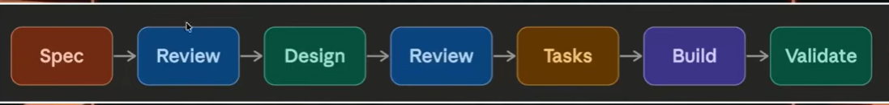

# [Spec-Driven Development in Claude Code](https://youtu.be/AjKFApDdffA?si=Xdnq2lhGJ0hvp67x)

Spec driven development (SDD) is a software development approach where a detailed specification document is written *before* any code is written.

The spec acts as the single source of truth for what the system should do, and all development flows from it.

## Contents of a Spec documnet

* Problem Statement
* Functional Requirements
* API contracts (inputs, outputs, data shapes)
* Constraints
* Edge cases and error handling
* Acceptance criteria

[Example of a Spec for Chat History Sidebar creation](https://youtu.be/AjKFApDdffA?list=PLKnIA16_RmvaYH3poI0oJvbDF4zEvpq8W&t=549)

### Spec Driven Development Workflow

[Example of a Spec for Chat History Sidebar creation with tech stack and tools](https://youtu.be/AjKFApDdffA?list=PLKnIA16_RmvaYH3poI0oJvbDF4zEvpq8W&t=830)

[Example of a Spec for Chat History Sidebar creation with Tasks to achieve](https://youtu.be/AjKFApDdffA?list=PLKnIA16_RmvaYH3poI0oJvbDF4zEvpq8W&t=1047)

Build => When coding started.

### Difference between vibe-coding and Spec-driven development

|  | Vibe Coding | Spec Driven Development |
| --- | --- | --- |
| Starting point | A feeling / rough idea | A written specification |
| Who decides requirements | AI infers them | You define them upfront |
| Control | Low — AI leads | High — you lead |
| Speed to first result | Very fast | Slower upfront, faster overall |
| Code quality | Unpredictable | Consistent and traceable |
| Works well for | Prototypes, exploration, side projects | Production systems, teams, complex apps |
| Failure mode | Spaghetti code you don't fully understand | Over-specified, rigid if requirements change |
| Debugging approach | Ask AI to fix it | Check against spec to find cause of issue |
| You need to understand the code? | Not really | Yes — you own the spec |

---